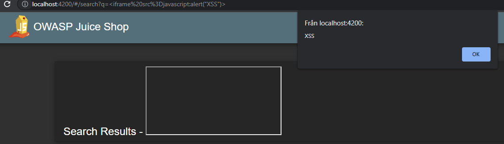
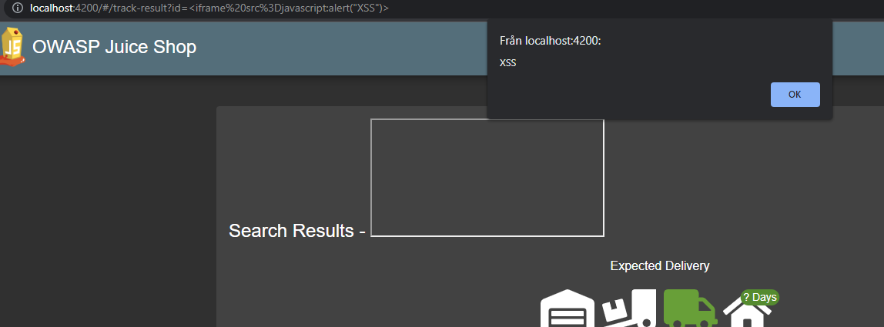
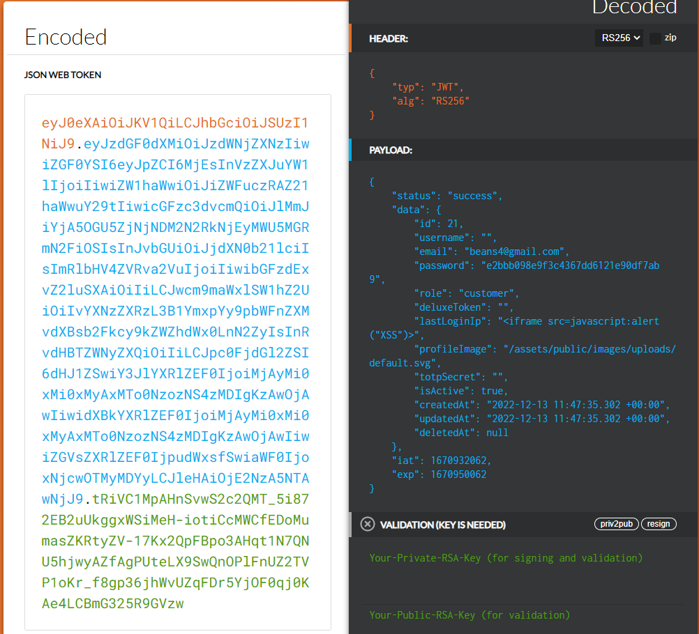
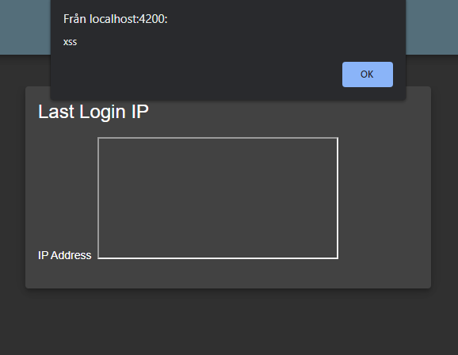
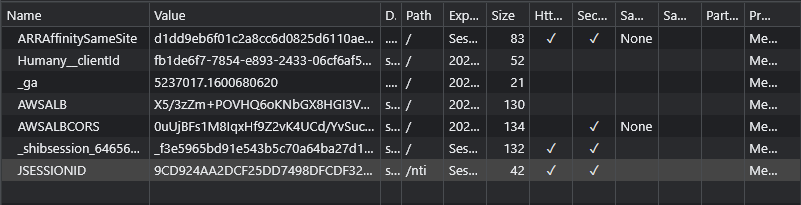
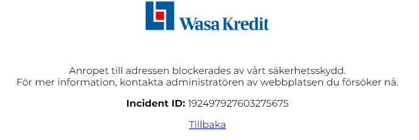
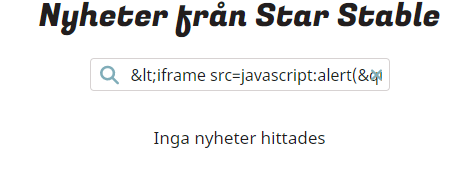

# Vecka 47
 
## Tisdag
Jag har använt mig av juice shop för att undersöka sökfält
 
Testade med iframe för att skapa en pop up från inputen
```html
<iframe src=javascript:alert("XSS")>
```

 
Detta gör jag för att kolla om en sida har sanitized inputs vilket är ett enkelt och säkert sätt att skydda sig mot xss.
 
## Onsdag
Har fortsatt att testa sökfältet men har även hittat att samma metod kan göras på alla saker som har en "=" i sig vilket gör att om man har en order id så kan man byta ut den satta id'n till vad man vill så istället för
```
Orderid="44884938"
```
Så kan man byta det till
```html
Orderid="<iframe src=javascript:alert("XSS")>"
```

Detta kommer byta ut det samt spara resultatet i sökfältet vilket senare kan skickas till oförberedda personer.

## Fredag 
Fortsatt job med sökfält för att försöka få ens cookies utprintade vilket inte gick antar pågrund av att det inte sparas några cookies vilket gör det svårt att printa ut dem. 
 
# Vecka 48
 
## Tisdag
Denna vecka så har jag börjar projektet att byta ut en del av sidan med hjälp av XSS. Specifikt så finns det en "last login ip" som tar information från en token så skulle man kunna byta ut informationen med hjälp av att ändra sin egna token?
 
## Onsdag
Så det finns tydligen två sätt att ändra sin token eller header beroende på vilken metod man använder sig av. Kommer ändra min token via en dekoder som sedan visar informationen och ändra ip delen till en attack test.



## Fredag 
Så har försökt använt andra metoden för att ändra "headers" på sidan till
```html
Orderid="<iframe src=javascript:alert("XSS")>"
```
Har haft problem med att få sidan att funka på Burp Suite som man måste använda. Tydligen funkar det inte via localhost vilket är lite problematiskt. 
 
# Vecka 49
 
## Tisdag
Dags att börja använda min lärdom och ska börja testa på fem olika sidor detta kommer jag använda som material för att undersöka XSS och om det är ett hot på dagens webb.
 
Så med hjälp av ett par snälla medarbetare så har jag kommit fram till ett par olika sidor dessa är.
 
* [Schoolsoft](https://sms.schoolsoft.se/nti/jsp/student/right_student_startpage.jsp)
* [Wasakredit](https://www.wasakredit.se/privat/)
* [Starstable](https://www.starstable.com/se)
* [TimN's sida](https://sneakers.timpan.ninja/)
* [Uruguays president/officella sida?](https://www.gub.uy/presidencia/)
 
Efter att ha kollat igenom Schoolsoft en stund så hittade jag en JSESSIONID som är ens personliga nyckel i din session vilket betyder att om någon annan får tag på din JSESSIONID så kan man logga in på ens konto utan att behöva kunna deras användarnamn eller lösenord.

 
## Onsdag
Har börjat kolla igenom sidorna för att se om de har en grundlig skydd mot XSS och har fått ett par olika resultat.
 
Wasa Kredit har ett system uppsatt som blockar requesten om man försöker använda sig av XSS attacker.

 
Medans Starstable har sanitation där specialtecknet byts ut vilket leder till att man inte kan använda sig av iframe eller script.
 

 
## Fredag
Skapat en Kalkylark för att försöka hålla det tydligare på vad som jag har kollat och icke men även vad resultaten har varit. Har även börjat leta vidare på mina sidor efter något sätt att få XSS attackera att kanske funka på någon riktigt sida.

# Vecka 50
 
 
 
 
 
 
 

